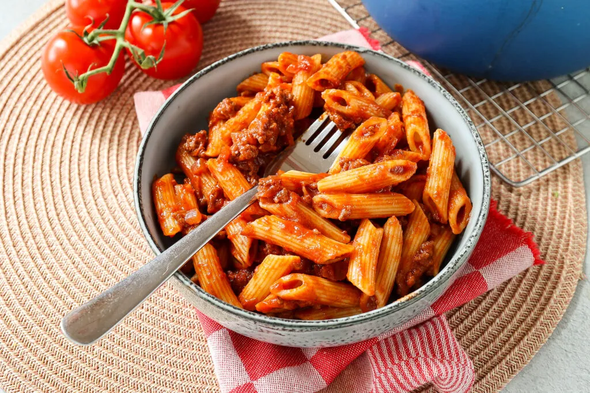

# Recept

Pasta met gehakt

Een heerlijk pasta recept met gehakt en tomaat.

Bereidingstijd: 35 minuten

---
# Benodigdheden

*    500 gr rundergehakt
*    1 rode ui
*    2 tenen knoflook
*    300 ml gezeefde tomaten/passata
*    2 el tomatenpuree
*    100 ml scheut rode wijn evt alcoholvrij
*    1 kaneelstokje
*    1 laurierblaadje
*    2 kruidnagels
*    zout en peper
*   300 gr pasta
* geraspte kaas
---
# Bereidingswijze

   1. Snipper de ui en snijd de knoflook fijn.
   2. Giet een scheutje olie in een pan en voeg het gehakt, ui, knoflook en een snufje zout en peper toe. Bak het gehakt rul.
   3. Voeg de rode wijn en een snufje peper en zout toe.
   4. Na een paar minuten voeg je de tomatenpuree toe en bak je dit 1 minuut mee.
   5. Voeg daarna de rest van de ingrediënten toe (de gezeefde tomaten, kaneelstokje, laurierblaadje en kruidnagel). Laat de saus nu een half uurtje pruttelen met de deksel er schuin op.
   6. Als de saus te droog wordt, voeg je een beetje water toe.
   7. Kook ondertussen de pasta volgens de instructies op de verpakking.
   8. Verwijder het laurierblaadje, de kruidnagels en het kaneelstokje.
   9. Serveer de pasta met de saus en wat geraspte kaas.

---
